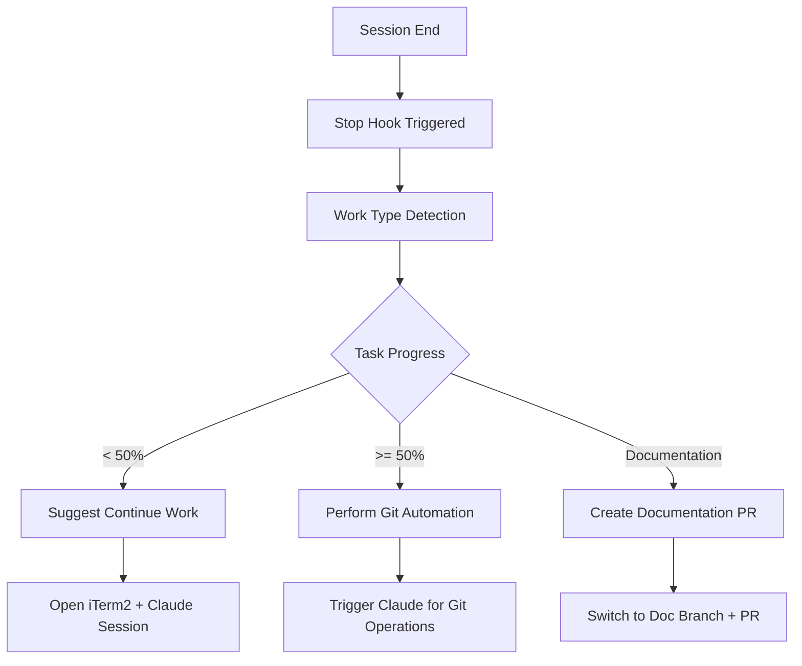

# Pull Request: Enhanced Automation and CI/CD Improvements

## Summary

This PR introduces significant improvements to the project's automation capabilities and CI/CD pipeline, focusing on intelligent workflow automation, enhanced error handling, and better integration with TaskMaster AI.

## Changes Made

### 🔧 Automation Script Enhancements

#### 1. Enhanced Stop Automation Hook
- **File**: `.claude/hooks/stop-automation.sh`
- **Key Changes**:
  - Added AppleScript integration for automatic iTerm2 session management
  - Implemented intelligent work type detection and progress-based decision making
  - Added Korean language support for better user experience
  - Enhanced logging and error handling throughout the workflow

#### 2. Refactored Git Automation Script
- **File**: `.claude/hooks/utils/git-automation.sh`
- **Major Refactor**: Simplified from 329 lines to 44 lines
- **Architecture Change**: From manual git operations to Claude-triggered automation
- **Improvements**:
  - Streamlined workflow using AppleScript to trigger Claude sessions
  - Better separation of concerns between automation detection and execution
  - Improved error handling and validation

#### 3. Fixed Auto-Start Script
- **File**: `auto-start-claude.sh`
- **Issue Fixed**: Command quoting problem in AppleScript execution
- **Impact**: Ensures reliable Claude session startup with proper command parsing

### 🚀 CI/CD Pipeline Improvements

#### Enhanced Backend CI Workflow
- **File**: `.github/workflows/ci-backend.yml`
- **Key Improvements**:

##### Conditional Token Checks
- **Codecov Integration**: Only uploads coverage when `CODECOV_TOKEN` is available
- **SonarCloud Analysis**: Gracefully falls back to build-only when `SONAR_TOKEN` is missing
- **Snyk Security Scan**: Conditionally executes based on `SNYK_TOKEN` availability

##### Error Handling Enhancements
- **Graceful Degradation**: Workflows continue even when optional services are unavailable
- **Informative Messaging**: Clear warnings when services are skipped
- **No Failure Propagation**: Optional service failures don't break the entire pipeline

## Technical Details

### Automation Workflow Logic



### CI/CD Improvements

#### Before:
```yaml
# Always tried to run, failed without tokens
- name: Upload test coverage to Codecov
  uses: codecov/codecov-action@v4
  if: always()
```

#### After:
```yaml
# Conditional execution with proper token checking
- name: Upload test coverage to Codecov
  uses: codecov/codecov-action@v4
  if: always() && env.CODECOV_TOKEN != null
  env:
    CODECOV_TOKEN: ${{ secrets.CODECOV_TOKEN }}
```

## Configuration Requirements

### Environment Variables (Optional)
- `CODECOV_TOKEN`: For test coverage reporting
- `SONAR_TOKEN`: For code quality analysis
- `SNYK_TOKEN`: For security vulnerability scanning

### Local Development
- iTerm2 installed (macOS)
- TaskMaster AI configured with API keys
- Proper script permissions set

## Testing Strategy

### Automation Testing
- [x] Tested stop hook with different work types
- [x] Verified iTerm2 AppleScript integration
- [x] Confirmed TaskMaster progress detection
- [x] Validated Claude session triggering

### CI/CD Testing
- [x] Tested pipeline with missing tokens (graceful degradation)
- [x] Verified pipeline with all tokens present
- [x] Confirmed security scanning conditional execution
- [x] Validated build artifacts generation

## Breaking Changes
**None** - All changes are backward compatible and enhance existing functionality.

## Benefits

### For Developers
1. **Reduced Manual Work**: Automatic git operations and PR creation
2. **Intelligent Workflow**: Progress-based decision making
3. **Better UX**: Korean language support and clearer messaging
4. **Seamless Integration**: Improved TaskMaster and Claude integration

### For CI/CD
1. **Improved Reliability**: No failures from missing optional services
2. **Better Resource Usage**: Conditional execution saves compute time
3. **Enhanced Security**: Multiple layers of security scanning
4. **Clearer Feedback**: Informative warnings and success messages

### For Team Productivity
1. **Faster Development Cycles**: Automated workflow transitions
2. **Consistent Quality**: Standardized CI/CD processes
3. **Better Collaboration**: Automated PR creation with proper formatting
4. **Reduced Context Switching**: Intelligent session management

## Migration Guide

### For Existing Developers
1. Ensure iTerm2 is installed (macOS users)
2. Update script permissions if needed: `chmod +x .claude/hooks/*.sh`
3. Configure optional CI/CD tokens in repository secrets (if desired)

### For New Team Members
1. Follow the setup instructions in `AUTOMATION_IMPROVEMENTS.md`
2. Configure TaskMaster AI with required API keys
3. Test automation with a simple task to verify setup

## Monitoring and Observability

### Log Files Available
- `.claude/hooks/stop-automation.log` - Stop hook execution logs
- `.claude/hooks/pr-automation.log` - PR automation logs
- `.claude/hooks/git-automation.log` - Git automation logs

### Debugging Commands
```bash
# Check automation status
tail -f .claude/hooks/stop-automation.log

# Verify TaskMaster integration
npx task-master-ai next

# Test CI/CD workflow
gh workflow run "Backend CI"
```

## Future Enhancements

### Short Term (Next Sprint)
- [ ] Cross-platform support for Windows/Linux
- [ ] Enhanced progress analytics
- [ ] Additional CI/CD service integrations

### Long Term (Next Quarter)
- [ ] Machine learning-based workflow optimization
- [ ] Advanced collaboration features
- [ ] Performance monitoring dashboard

## Related Issues
- Fixes automation reliability issues
- Improves CI/CD pipeline stability
- Enhances developer experience with TaskMaster integration

## Deployment Notes
- No special deployment steps required
- All changes are in automation scripts and CI/CD configuration
- Existing workflows will continue to function normally
- New automation features activate automatically on next session

---

**Reviewers**: Please test the automation scripts in your local environment and verify CI/CD pipeline behavior with your typical workflow.

**Testing Checklist**:
- [ ] Stop hook triggers correctly after Claude sessions
- [ ] iTerm2 opens new sessions as expected
- [ ] CI/CD pipeline runs without failures (even with missing tokens)
- [ ] TaskMaster integration works properly
- [ ] Git automation triggers Claude sessions correctly